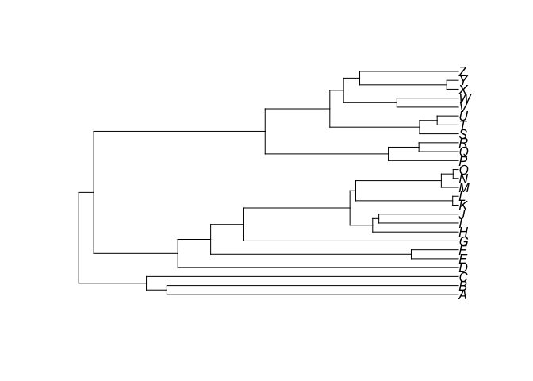
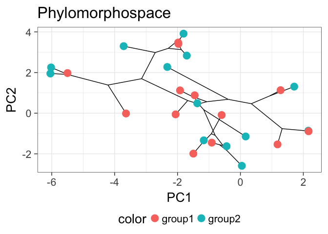

# readme
Andrew Barr  
9/18/2017  

## install and load package

Note: this assumes you already installed the `devtools` package.  If you haven't you should do so using the normal R package management tools. 


```r
#devtools::install_github("wabarr/ggphylomorpho")
library(ggphylomorpho)
```

## make example data


```r
sampleData <- makesampledata()

plot(sampleData$tree)
```

<!-- -->

```r
head(sampleData$DF)
```

```
##           PC1         PC2 taxon  group
## A -2.97831839  2.67580286     A group1
## B -0.18117859 -1.14645602     B group2
## C -0.69258460 -2.32020109     C group1
## D -0.40664199  0.09467764     D group2
## E -0.01512143  1.23078740     E group1
## F  0.93301701  0.65321188     F group2
```

## check out the documentation for the function

```r
?ggphylomorpho
```

## make a phylomorphospace


```r
ggphylomorpho(tree=sampleData$tree, tipinfo=sampleData$DF)
```

<!-- -->

